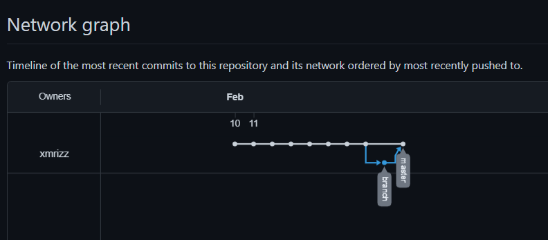

# Tugas 1 SEKURO *Programming*

<p>&nbsp;</p>

## Developer:
### 16521369 - Ahmad Rizki

<p>&nbsp;</p>

## Table of Contents
1. [APA ITU GIT & GITHUB](https://www.youtube.com/watch?v=lTMZxWMjXQU&list=PLFIM0718LjIVknj6sgsSceMqlq242-jNf&index=1&t=710s)
2. [BEKERJA DENGAN GITHUB](https://www.youtube.com/watch?v=Q3Id0DgcrXY&list=PLFIM0718LjIVknj6sgsSceMqlq242-jNf&index=2&t=421s)
3. [GITHUB: BRANCH](https://www.youtube.com/watch?v=k1QXd-8VbPY&list=PLFIM0718LjIVknj6sgsSceMqlq242-jNf&index=3&t=723s)
4. [GITHUB: FORK](https://www.youtube.com/watch?v=8rry2ncZmfg&list=PLFIM0718LjIVknj6sgsSceMqlq242-jNf&index=4)
5. [BEKERJA DENGAN GIT](https://www.youtube.com/watch?v=e-6OkXRqWaE&list=PLFIM0718LjIVknj6sgsSceMqlq242-jNf&index=5)
6. [GIT BRANCH & MERGE](https://www.youtube.com/watch?v=EGl7KxVOyNs&list=PLFIM0718LjIVknj6sgsSceMqlq242-jNf&index=6)
7. [GITIGNORE](https://www.youtube.com/watch?v=LK3kX4n-vLM&list=PLFIM0718LjIVknj6sgsSceMqlq242-jNf&index=12)
8. DOCUMENTATION

<p>&nbsp;</p>

## APA ITU GIT & GITHUB

GIT adalah salah satu contoh dari ***Version Control System*** atau disebut juga ***revision control system*** atau **source code management**. VCS (Version Control System) adalah sistem yang mengelola perubahan dari sebuah dokumen, program komputer, website, dan kumpulan informasi lain. Perubahan-perubahan tersebut dikelola dalama sebuah folder yang disebut repository/repo dan setiap perubahan perlu dilakukan commit terlebih dahulu.
Beberapa hal mengenai VCS :
- Sebuah sistem yang dapat menyimpan 'rekaman/snapshot perubahan pada source code'
- Memungkinkan bekerja berkolaborasi dengan lebih baik
- Mengetahui siapa yang melakukan dan kapan sebuah perubahan terjadi
- Memungkinkan kita untuk kembali ke keadaan sebelum perubahan (checkout)

GitHub adalah sebuah layanan cloud untuk menyimpan & mengelola project/repo git. Sama seperti pada GIT, github juga dapat dilakukan pembuatan repo, commit, branch, merge, namun semua itu dilakukan secara online. Atau bisa dibilang github adalah sebuah web yang didalamnya menggunakan web

GIT dan GitHub juga dapat dilakukan bersamaan dengan menggunakan push and pull

<p>&nbsp;</p>

## BEKERJA DENGAN GITHUB

Cara mengelola repository pada GitHub
- Buat akun GitHub terlebih dahulu pada https://github.com/.
- Tekan tanda (+) di bagian kanan atas dan tekan *"New Repository"*
- Isi nama repository beserta deskripsi(opsional), pilih apakah repo akan dipublic atau di private
- Centang *"Initialize this repository with a README"*, jika ingin repository memiliki file README.
- Lalu tekan Create Repository
- Jika didalam repo ingin ditambahkan file, tekan *"Create New FIle"*, 
- Setiap perubahan di dalam repository perlu dilakukan *"commit"* yang history commit akan tersimpan di dalam GitHub

<p>&nbsp;</p>

## GITHUB: BRANCH
Branching adalah membuat cabang dari repositori utama dan melanjutkan melakukan pekerjaan pada cabang yang baru tersebut tanpa perlu khawatir mengacaukan yang utama. Dengan branching memungkinkan 2 orang untuk melakukan kolaborasi dengan mengedit branch yang berbeda, yang kemudian akan disatukan dengan fitur git merge. Cara membuat Git Branch ada 2 cara :
- membuat branch secara langsung pada repository
<br>  </br>
- menambah branch saat ingin melakukan commit, *"Create a new branch for this commit and start a pull request."*
<br>  </br>

Setiap branch yang telah dibuat, dapat di gabungkan kembali ke branch utama (*master*) dengan melakukan merge dengan syarat tidak adanya konflik antara branch utama dan branch tersebut, atau dalam GitHub juga disebut *pull request*.
<br>  </br>

History dalam perubahan di repository dapat dilihat dalam sebuah graph di menu *"Insight"* bagian *'Network'*


<p>&nbsp;</p>

## GITHUB: FORK
GitHub memungkinkan repository milik orang lain beserta history di dalam repository diduplikat ke dalam repository pribadi kita. Sehingga, kita dapat memodifikasi repo tersebut untuk kita gunakan pada project kita tersendiri, atau kita juga dapat berkontribusi pada repo orang lain dengan mengusulkan perubahan tersebut ke pemilik repo (*pull request*).
<br></br>

<p>&nbsp;</p>

## BEKERJA DENGAN GIT

Git dapat di install https://git-scm.com. Kemudian akan ada tampilan git bash yang merupakan sebuah terminal bawaan dari Git. Sama seperti pada GitHub. 

Kita dapat membuat sebuah folder dalam perangkat kita menjadi sebuah repository dengan mengubah directory pada Git Bash sesuai folder, kemudian melakukan
```
git init
```
ketika ingin melakukan perubahan pada repository tersebut terlebih dahulu melakukan
```
git add .
```
lalu melakukan commit dengan
```
git commit -m "<pesan>"
```
lalu lakukan push untuk mengirim perubahan ke dalam GitHub

<p>&nbsp;</p>

## GIT BRANCH & MERGE
Sama seperi pada GitHub, cabang berguna untuk membuat cabang dari file yang di master. Cabang berguna agar anggota dalam tim dapat bekerja tanpa mengganggu cabang dari master. Hal ini berguna agar setiap orang bekerja pada branchnya sendiri.
Cara membuat branch :
- ketik 
``` 
git branch <nama-branch> 
```
- untuk melihat semua branch, gunakan 
``` 
git branch
 ```
- untuk pindah ke dalam branch lain, gunakan 
``` 
git checkout <nama-branch> 
```

<p>&nbsp;</p>

## GIT IGNORE
.gitignore adalah sebuah file yang dapat kita simpan di dalam repository git kita. Fungsi dari file ini agar pada saat commit ada file yang tidak ikut terbawa ke dalam add. Cara menggunakan file ini hanya dengan membuuat file .gitignore dan mendaftar file-file yang ingin dimasukkan ke dalamnya.
<br></br>

<p>&nbsp;</p>

## Reference <a name = "ref"></a>

- MODUL 1 PROGRAMMING SEKURO Pengenalan Git & GitHub

- Playlist *GIT & GITHUB* Channel Web Programming UNPAS. https://www.youtube.com/playlist?list=PLFIM0718LjIVknj6sgsSceMqlq242-jNf. Accessed on 10 February 2022

<p>&nbsp;</p>

## DOCUMENTATION
.png)
.png)
.png)
